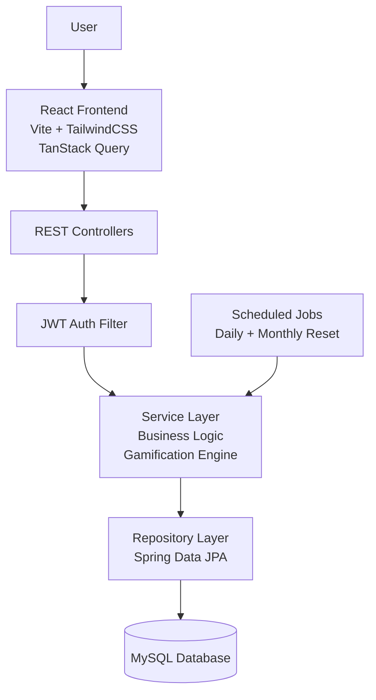

<div align="center">

# GoldGuild

### *Gamified Personal Finance — Track, Save, Compete, Level Up*

[](https://spring.io/projects/spring-boot)
[](https://react.dev/)
[](https://openjdk.org/projects/jdk/21/)
[](https://www.mysql.com/)
[](https://vitejs.dev/)
[](https://tailwindcss.com/)
[](https://jwt.io/)
[](https://gold-guild.vercel.app/)

---

**[Live Demo](https://gold-guild.vercel.app/) · [Overview](#overview) · [Preview](#preview) · [Features](#features) · [XP System](#xp--level-system) · [Architecture](#architecture) · [Tech Stack](#tech-stack) · [API Reference](#api-reference)**

</div>

---

## Overview

**GoldGuild** is a full-stack gamified personal finance app that turns budgeting into an RPG-like experience. Earn XP for logging expenses, level up your profile, unlock achievement badges, maintain daily streaks, and compete on a global leaderboard.

> **Core Philosophy:** Financial discipline shouldn't feel like a chore. GoldGuild rewards good habits with a game-like progression system that keeps users motivated.

---

## Preview

| Dashboard | Expenses |
| :---: | :---: |
|  |  |

| Goals | Analytics |
| :---: | :---: |
|  |  |

---

## Features

| Module | Highlights |
|---|---|
| **Expenses** | Log across 6 categories, full CRUD, filter by month, earn +10 XP per log |
| **Budgets** | Per-category monthly budgets, live spent vs. remaining, earn +50 XP for staying under |
| **Saving Goals** | Create goals, contribute incrementally, earn +20 XP per contribution, +100 XP on completion |
| **Gamification** | XP system, level-up every 500 XP, 7-day & 30-day streaks, 9 unique badges |
| **Social** | Friend requests by username, global XP leaderboard |
| **Analytics** | Visual spending breakdowns and monthly comparisons |
| **Auth** | JWT-based stateless auth, BCrypt password hashing, secured REST endpoints |

### Achievement Badges

| Badge | Unlock Condition |
|---|---|
| `FIRST_EXPENSE` | Log your first expense |
| `FIRST_GOAL` | Create your first saving goal |
| `GOAL_COMPLETED` | Fully complete a goal |
| `UNDER_BUDGET` | Stay under budget for a category |
| `STREAK_7` / `STREAK_30` | Maintain a 7-day or 30-day streak |
| `LEVEL_5` | Reach Level 5 |
| `XP_1000` | Accumulate 1,000 total XP |

---

## XP & Level System

```text
Level = floor(Total XP / 500) + 1

XP Rewards:
  Log an expense      →  +10 XP
  Contribute to goal  →  +20 XP
  Stay under budget   →  +50 XP
  Complete a goal     → +100 XP
```

---

## Architecture



---

## Tech Stack

| Layer | Technologies |
|---|---|
| **Backend** | Java 21, Spring Boot 4, Spring Security, Spring Data JPA, JJWT 0.12, MySQL 8 |
| **Frontend** | React 19, Vite 8, TailwindCSS 4, shadcn/ui, TanStack Query 5, Axios |

---

## Engineering Challenges

While building GoldGuild, key architectural and technical hurdles solved include:

- Designing an XP reward system that feels meaningful
- Implementing stateless JWT authentication using Spring Security
- Managing protected and public routes securely
- Handling cache invalidation after frontend mutations using TanStack Query
- Writing scheduled cron jobs for streak resets and monthly budget resets
- Preventing duplicate badge unlock conditions - Structuring backend services cleanly as project complexity increased
- Structuring clean separation between Controllers, Services, DTOs, and Repositories

---

## Deployment

| Layer | Hosting Provider |
|---|---|
| **Frontend** | Vercel |
| **Backend** | Render |
| **Database** | MySQL |

---

## Getting Started

### Prerequisites
- **Java 21+** and Maven (or use included `./mvnw`)
- **Node.js 18+** and npm
- **MySQL 8+** running locally

### 1. Clone Repository

```bash
git clone https://github.com/AKB9988/GoldGuild.git
cd GoldGuild
```

### 2. Backend Setup

Create a MySQL database:
```sql
CREATE DATABASE goldguild;
```

Create `src/main/resources/application.properties`:
```properties
spring.datasource.url=jdbc:mysql://localhost:3306/goldguild
spring.datasource.username=YOUR_DB_USERNAME
spring.datasource.password=YOUR_DB_PASSWORD
spring.datasource.driver-class-name=com.mysql.cj.jdbc.Driver

spring.jpa.hibernate.ddl-auto=update

jwt.secret=YOUR_SUPER_SECRET_KEY_AT_LEAST_256_BITS_LONG
jwt.expiration=86400000

server.port=8080
```

> **Warning:** Never commit `application.properties` to version control — it is already listed in `.gitignore`.

Run the backend:
```bash
# Windows
mvnw.cmd spring-boot:run

# Mac / Linux
./mvnw spring-boot:run
```

API live at → `http://localhost:8080`

### 3. Frontend Setup

```bash
cd Frontend/GoldGuild_Frontend
npm install
npm run dev
```

Frontend live at → `http://localhost:5173`

---

## API Reference

| Controller | Base Path | Key Endpoints |
|---|---|---|
| `AuthController` | `/api/auth` | `POST /register`, `POST /login` |
| `ExpenseController` | `/api/expenses` | `GET`, `POST`, `PUT /{id}`, `DELETE /{id}`, `GET /month/{month}` |
| `BudgetController` | `/api/budgets` | `POST`, `GET /status?month=` |
| `SavingGoalController` | `/api/goals` | `GET`, `POST`, `PUT /{id}/contribute`, `DELETE /{id}` |
| `GamificationController` | `/api/gamification` | `GET /profile`, `GET /leaderboard` |
| `FriendshipController` | `/api/friends` | `POST /request`, `PUT /{id}/accept`, `GET /pending`, `GET` |

All protected endpoints require:
```http
Authorization: Bearer <your_jwt_token>
```

---

<div align="center">

Powered by Spring Boot & React · Designed to make finance fun

</div>
